# Revenue Recovery Intelligence

<p>
  
  
  
  
  
  
</p>

An economic decision layer for failed-payment recovery, built on Razorpay for
the Razorpay AI Buildathon 2026 (Track 3 — AI Revenue Recovery).

> Revenue Recovery Intelligence doesn't blindly retry failed payments. It
> decides when to **Act**, **Wait**, **Stop**, or **Escalate**, applies safety
> and policy gates, records the reasoning, and measures whether recovery was
> actually incremental.

Razorpay already knows how to retry a payment. The unanswered question is
whether intervening on a specific payment creates revenue that would not have
arrived anyway — and this system is built to answer that question, refuse to
act when the answer is no, and prove the difference afterwards.


**Contents** ·
[Live deployment](#live-deployment) ·
[What this system does](#what-this-system-does) ·
[Architecture](#architecture) ·
[Product tour](#product-tour) ·
[Verified status](#verified-status-1-september-2026) ·
[Real vs simulated](#what-is-real-vs-simulated) ·
[Razorpay lifecycle evidence](#razorpay-lifecycle-evidence) ·
[Executing a decision](#executing-a-decision) ·
[Demo Workspace](#demo-workspace) ·
[Repository layout](#repository-layout) ·
[Setup](#setup) ·
[Security posture](#security-posture) ·
[Known limitations](#known-limitations) ·
[Documentation](#documentation)

---

## Live deployment

| | |
|---|---|
| Production URL | https://revenue-recovery-intelligence.vercel.app |
| Deployment | Production tracks `main`; every push deploys automatically |
| Verified | 2 September 2026 |

The Demo Workspace operator account (`demo-operator@revenue-recovery.demo`) is
seeded from `DEMO_OPERATOR_PASSWORD`; the password is an environment secret and
is deliberately not printed in this repository.

## What this system does

1. **Ingests real Razorpay events.** `POST /api/webhooks/razorpay` verifies an
   HMAC-SHA256 signature in constant time, deduplicates on
   `x-razorpay-event-id`, persists a `PaymentEvent`, and returns before doing
   any downstream work.
2. **Turns failures into risk.** Association resolves the merchant and payment
   and records Razorpay's own failure signals (`error_code`, `error_reason`,
   `error_source`, `error_step`) verbatim on the `Payment`. A `RevenueRiskEvent`
   is then created with a diagnosis mapped from those signals
   ([`failureReasonMapping.ts`](apps/web/src/lib/recovery/failureReasonMapping.ts))
   and the amount at risk, tagged `SIMULATED` or `REAL_RAZORPAY_TEST_MODE` —
   never both. Anything unrecognised stays `STATE_UNCERTAIN`: an unmapped code
   degrades to "we don't know", never to a confident diagnosis nobody made.
3. **Decides economically.** For each candidate action:

   ```
   expectedIncrementalValue =
       amount × ( P(recovery | intervention) − P(recovery | no intervention) )
     − interventionCost
     − riskPenalty
   ```

   A positive probability of recovery is not a reason to act; only positive
   *incremental* value is.
4. **Gates on safety and policy.** A deterministic safety gate runs in fixed
   priority order — already succeeded, duplicate execution risk, retry limit,
   cooldown, amount ceiling, active incident — and an unsafe result can never be
   overridden into ACT. Selection is further restricted to strategies the
   Execution Service can actually perform
   ([`executableStrategies.ts`](apps/web/src/lib/recovery/executableStrategies.ts)),
   so the engine can never decide on an action the product cannot carry out.
5. **Records why.** Each decision persists the inputs it was made from: a
   `ModelPrediction` row per candidate strategy (predicted probability plus the
   model version), a `CandidateAction` row per strategy (predicted success,
   incremental lift, expected net value), the chosen action and expected
   incremental value on the `Decision` itself, the natural-recovery probability
   on the `RevenueRiskEvent`, and a `Decision` audit event whose `details` JSON
   carries the policy version, model version, and the engine's reason code. The
   Decision Detail page renders exactly those rows. The schema also defines a
   `DecisionEvidence` table, but **no code path writes to it today and it is
   empty** — the reasoning above is what actually backs the page.
6. **Executes only when an operator says so.** An un-executed ACT decision
   carries an Execute control on Decision Detail, which calls
   `POST /api/recovery/decisions/[decisionId]/execute`. The endpoint loads the
   stored decision scoped to the operator's merchant and hands it to the
   Execution Service unchanged — it cannot turn a WAIT, STOP or ESCALATE into
   an ACT, and cannot substitute a different strategy. Execution is
   **operator-approved, never autonomous**.
7. **Measures causality.** Randomized treatment/control assignment with 95%
   confidence intervals, where a result may only reach `VALID_EFFECT` under an
   explicitly configured minimum-effect threshold — natural recovery is never
   allowed to read as lift.
8. **Explains, read-only.** The Assistant answers operational questions from the
   same authorized query services the pages use, and labels every figure as
   `observed`, `estimated`, `validated_causal`, or `none`.

## Architecture

### Stack

| Layer | Technology |
|---|---|
| Application | Next.js 16 (App Router, React Server Components, Turbopack) |
| Language | TypeScript, strict mode |
| Database | PostgreSQL via Prisma 5 — 21 models, 12 migrations |
| Payments | Razorpay Test Mode — webhooks in, REST API out |
| Auth | Self-hosted operator sessions: `scrypt` password hashing, opaque server-side session tokens |
| Tests | Vitest — 671 unit tests, 145 integration tests against a real database |
| Build/CI | Turborepo + pnpm workspaces; Vercel production deploys track `main` |

### System architecture

```mermaid
flowchart TB
    RZP_IN["Razorpay Test Mode<br/>payment.failed · payment.captured"]

    subgraph INGEST["Ingestion — lib/webhooks, lib/processing"]
        direction TB
        WH["POST /api/webhooks/razorpay"]
        SIG["signature.ts<br/>timing-safe HMAC-SHA256"]
        DEDUP["dedupe on x-razorpay-event-id<br/>unique constraint"]
        QUEUE["processing/queue.ts<br/>in-process boundary via after&#40;&#41;<br/>the webhook has already responded"]
        ASSOC["paymentAssociation.ts<br/>resolve merchant + payment,<br/>copy error_code · error_reason<br/>· error_source · error_step"]
        WH --> SIG --> DEDUP --> QUEUE --> ASSOC
    end

    subgraph DECIDE["Decision layer — lib/recovery"]
        direction TB
        MAP["failureReasonMapping.ts<br/>Razorpay signals to diagnosis"]
        MODELS["naturalRecoveryModel.ts<br/>interventionResponseModel.ts<br/>cold-start baselines, versioned"]
        ECON["economics.ts<br/>expected incremental value"]
        SAFE["safetyGate.ts<br/>deterministic, never overridable"]
        POL["policy.ts<br/>policy-v1 limits"]
        ENG["decisionEngine.ts<br/>ACT · WAIT · STOP · ESCALATE"]
        MAP --> MODELS --> ECON --> ENG
        SAFE --> ENG
        POL --> ENG
    end

    UI["Operator console<br/>Overview · Recovery · Decision Detail · Experiments<br/>Reports · Audit · Assistant · Security"]

    subgraph EXEC["Execution — operator-approved only"]
        direction TB
        API["POST /api/recovery/decisions/:id/execute"]
        DES["decisionExecutionService.ts<br/>merchant-scoped, stale-checked,<br/>duplicate-safe"]
        ES["executionService.ts<br/>creates a Razorpay Payment Link"]
        API --> DES --> ES
    end

    RZP_OUT["Razorpay REST API<br/>plink_… created"]

    subgraph MEASURE["Measurement"]
        direction TB
        OUT["outcomes/attributionEngine.ts<br/>natural vs intervention recovery"]
        EXP["experiments/<br/>randomized assignment,<br/>95% CI, VALID_EFFECT gate"]
        AUD["recovery/audit.ts<br/>append-only AuditEvent"]
        OUT --> EXP
    end

    DB[("PostgreSQL · Prisma<br/>every query scoped by merchantId")]

    RZP_IN --> WH
    ASSOC --> MAP
    ASSOC --> OUT
    ENG -->|"ACT, awaiting an operator"| UI
    UI -->|"operator clicks Execute"| API
    ES --> RZP_OUT
    ES --> OUT
    ENG --> AUD
    ES --> AUD
    OUT --> AUD
    ENG --> DB
    ES --> DB
    AUD --> DB
    DB --> UI
```

Nothing in that graph runs a language model. The Decision Engine is deterministic
TypeScript; the Assistant sits beside it, read-only, and cannot write to any of it.

### Request lifecycle — a failed payment, end to end

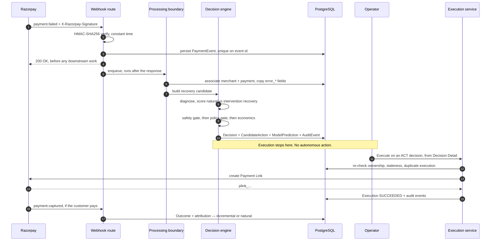

### Decision logic

The engine prices every candidate strategy, then walks a fixed ladder. The first
rule that matches wins, and the reason code it produces is stored on the decision.

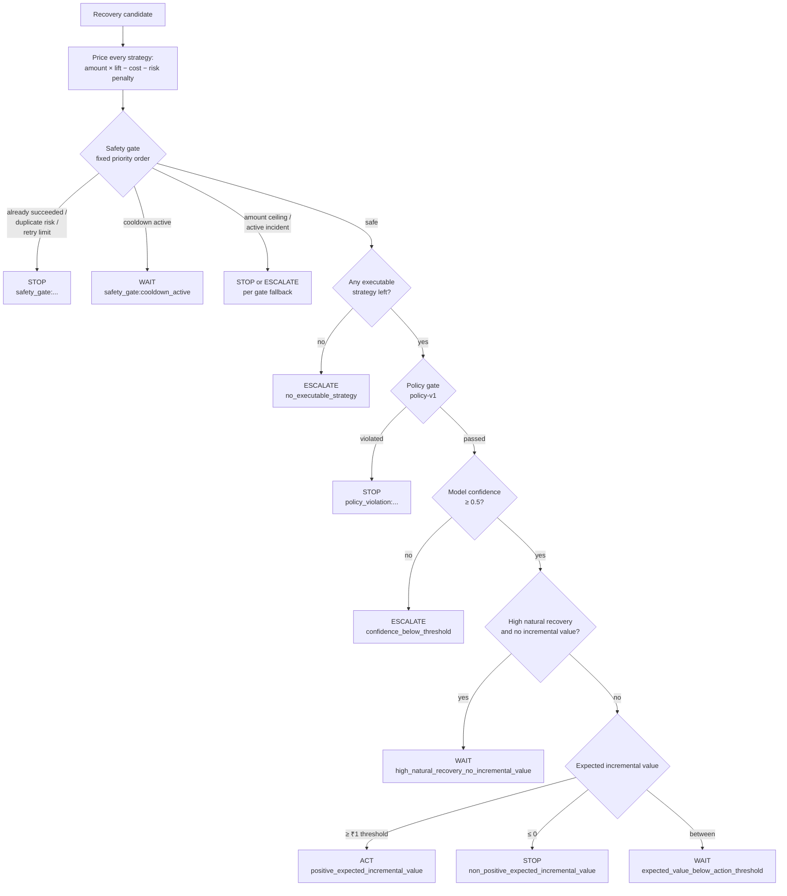

An unsafe result can never be overridden into ACT, and the engine can only select
a strategy the Execution Service can actually perform — so it can never decide on
an action the product cannot carry out.

### Data model

The 21-model schema in full is documented in [docs/domain-model.md](docs/domain-model.md).
These are the tables the recovery path writes on every event:

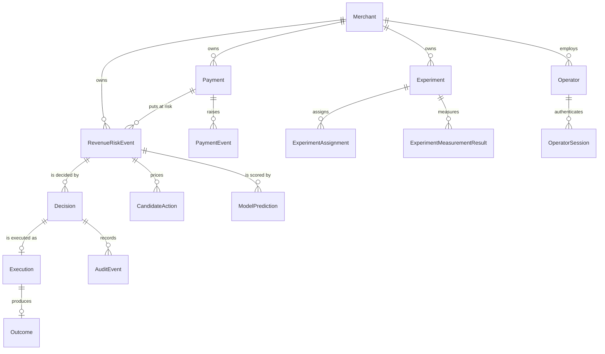

Every merchant-scoped query filters on `merchantId` in the database `WHERE`
clause — never fetched broadly and filtered in application code — so another
merchant's row is indistinguishable from a row that does not exist.

---

## Product tour

Screenshots below are the live production deployment running against the Demo
Workspace, which is seeded with clearly-synthetic data and labelled as such in
the application itself. Open it yourself at
[revenue-recovery-intelligence.vercel.app](https://revenue-recovery-intelligence.vercel.app)
— **Explore the demo workspace** needs no account.

### Sign in

The entry point states what the product does before asking for anything. An
evaluator can skip the form entirely and open the Demo Workspace in one click.

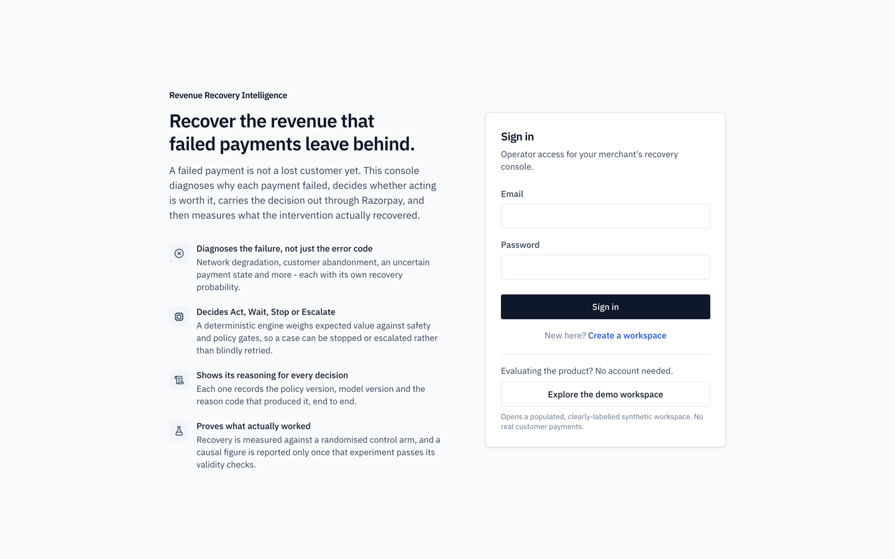

### Overview — where the money is right now

Revenue at risk, recovery opportunity, and recovered GMV, plus the causal
incremental figure from the completed experiment. The decision mix and outcome
distribution show what the engine has actually been deciding, and the operational
attention list is ranked by amount at risk so the largest exposures surface first.

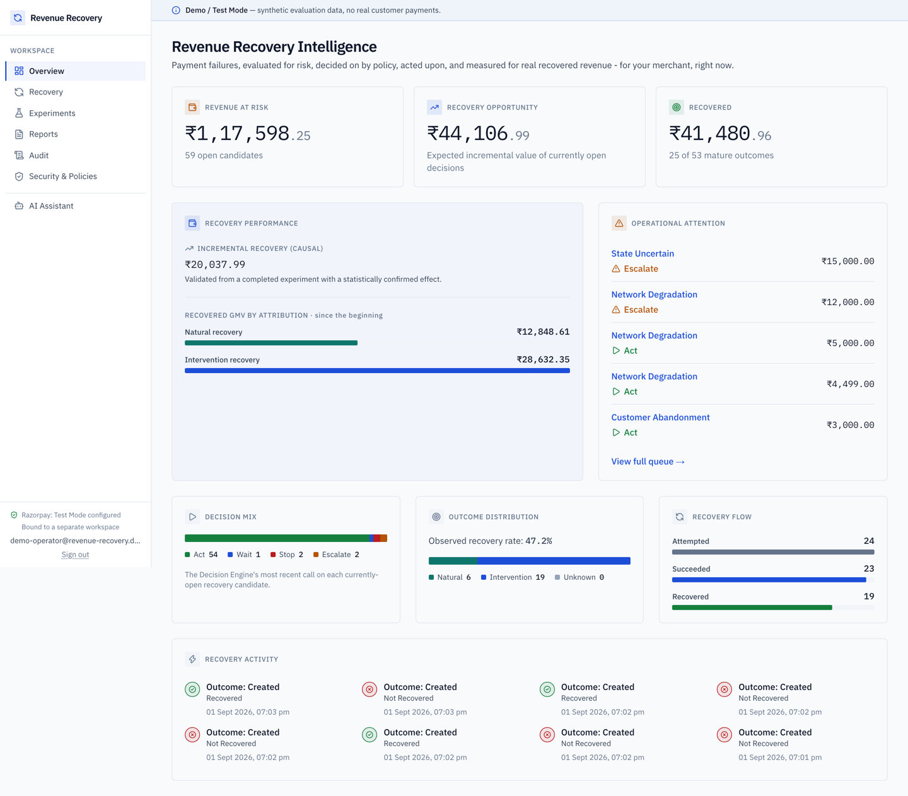

### Recovery queue — every at-risk payment and its verdict

One row per revenue-risk event: the diagnosis the failure signals produced, the
natural recovery probability, the amount at risk, the engine's decision, the
recommended action, and its predicted success. Filterable by status and decision
type.

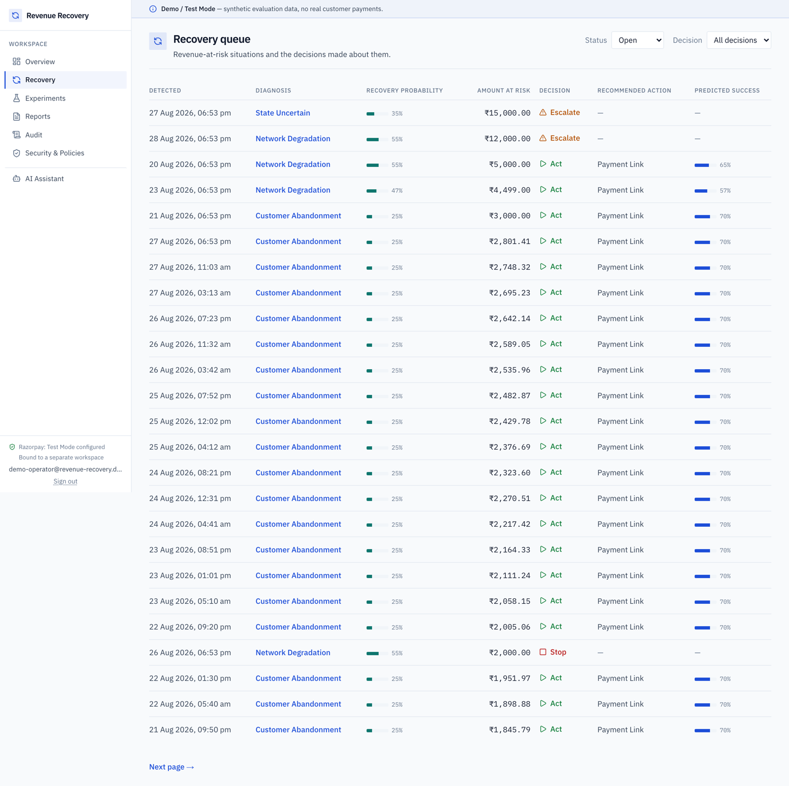

### Decision detail — the full reasoning behind one call

A lifecycle strip from payment to outcome, the expected incremental value, the
recovery opportunity, the recommended action with its predicted success and cost,
and the decision context — policy version, model version, and the reason code that
produced the verdict. Model predictions are shown as advisory input only. On an
un-executed ACT decision, this page carries the **Execute recovery** control; the
same safety, policy, and experiment controls are re-checked server-side when it is
pressed.

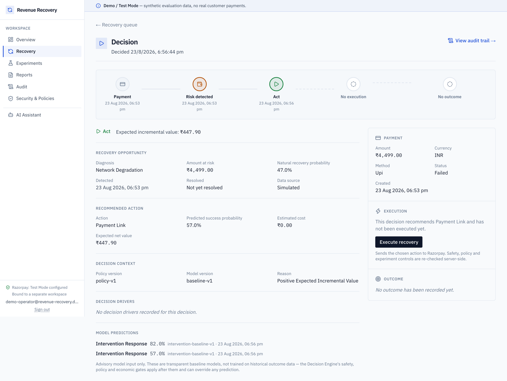

### Decision audit trail — what was recorded, in order

The chronological record for a single decision: what was selected, under which
policy and model version, and why. Written append-only as the decision is made.

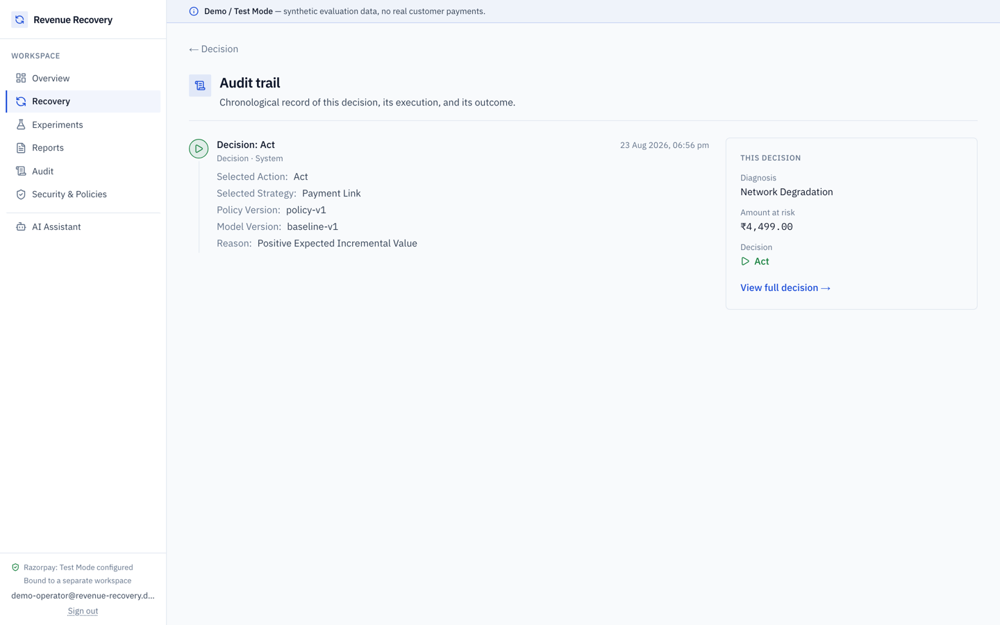

### Experiments — recovery measured against a control arm

Randomized treatment/control experiments and their measurement results. The list
shows status and window; nothing here claims an effect on its own.

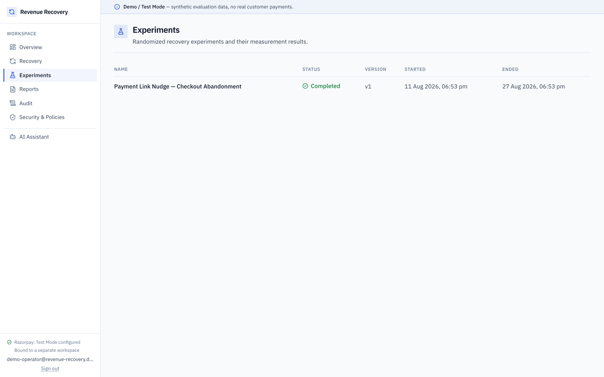

### Experiment detail — causal evidence, or none at all

Treatment versus control with recovery rates, recovered GMV, and a 95% confidence
interval on the observed difference — labelled as a raw sample statistic, not a
causal claim. Beside it, the incremental recovered GMV is reported only once every
validity check passes: arm balance, no duplicate assignments, no control
contamination, no assignment-after-decision timing violations, minimum analyzable
units per arm. A result reaches `VALID_EFFECT` only under an explicitly configured
minimum-effect threshold, so natural recovery can never read as lift.

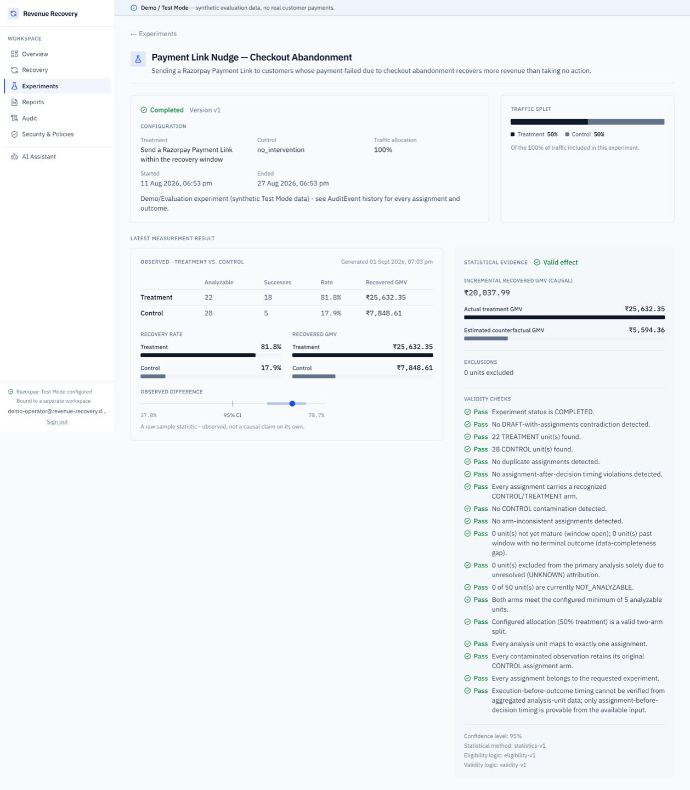

### Reports — the operator's export

Executive summary, payment activity by status and method, recovery performance
split into natural versus intervention recovery, decision analysis, experiment
evidence, and the audit methodology — over any date range, exportable as CSV or
PDF.

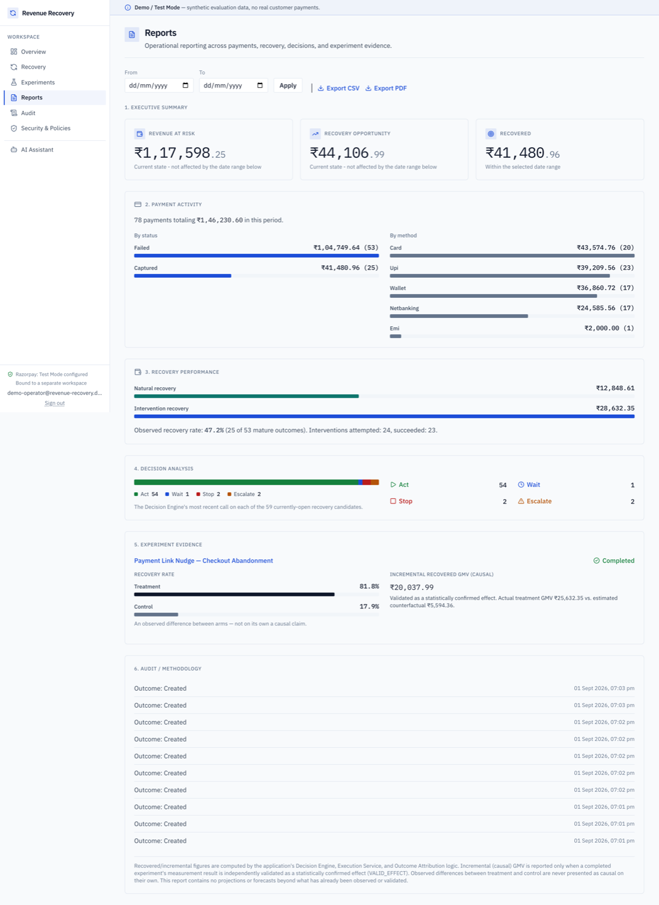

### Audit — every decision, execution, and outcome

A merchant-wide chronological record. Each entry names the actor, the entity, and
the versioned policy that governed it. Audit responses are built from an explicit
per-entity field allowlist, so a field not on that list can never reach an API
response.

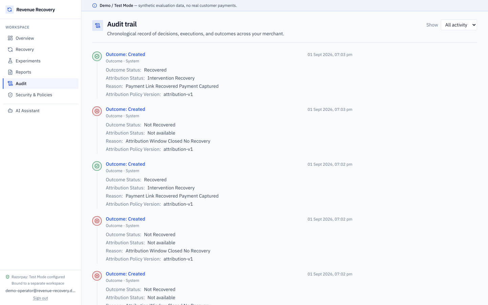

### AI Assistant — read-only, and honest about it

Answers operational questions from the same authorized, merchant-scoped query
services the pages use. Every figure is labelled `observed`, `estimated`,
`validated_causal`, or `none`, and each answer names the query it was grounded in.
It uses no generative language model: answers are composed by fixed deterministic
logic, so it cannot invent a figure it does not have, and it cannot execute a
payment, change a decision, or override the Decision Engine.

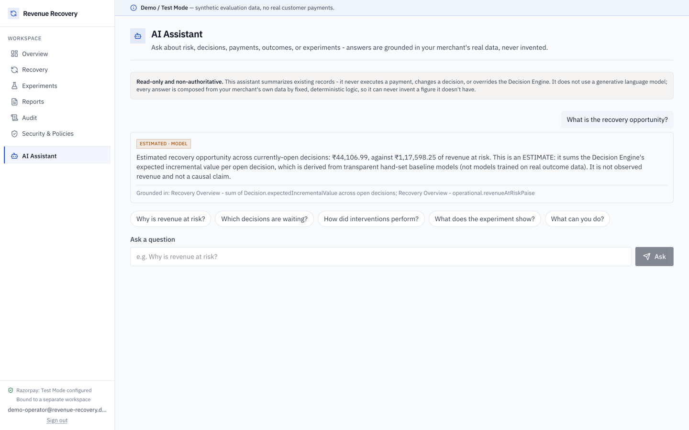

### Security & Policies — the claims, and the limits

Razorpay integration status read from this deployment's own configuration at page
load, the security architecture end to end, and an explicit split between what is
implemented, what is deliberately not, what is on the roadmap, and what is out of
scope. It states plainly that alignment with a security principle is not
certification against a standard.

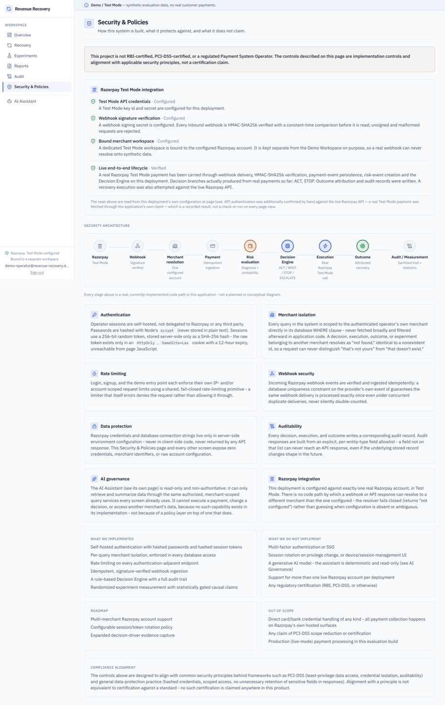

---

## Verified status (1 September 2026)

| Check | Result |
|---|---|
| Unit tests (`pnpm test`, 63 files) | **671 passed** |
| Integration tests (`pnpm test:integration`, 20 files) | **145 passed** |
| `pnpm lint` | clean |
| `pnpm typecheck` | clean |
| `pnpm build` | clean (Next.js 16, Turbopack) |
| `prisma validate` / `migrate status` | schema valid, 12 migrations, database up to date |
| Production deployment | Ready; tracks `main`, every push deploys automatically |

The integration suite includes `executionService.integration.test.ts`, which
creates a real Payment Link in Razorpay Test Mode through the Execution
Service. It passes. The suite talks to a remote Postgres pooler, so an
individual test can fail on a dropped connection; rerun the file rather than
reading that as a code defect.

## What is real vs simulated

| Component | Status | Detail |
|---|---|---|
| Payment webhook ingestion | **Real, verified** | Idempotent on `x-razorpay-event-id`; real Test Mode deliveries persisted |
| Webhook signature verification | **Real, verified** | Timing-safe HMAC-SHA256 ([`signature.ts`](apps/web/src/lib/razorpay/signature.ts)) |
| Merchant association & risk creation | **Real, verified** | Real event produced a `RevenueRiskEvent` tagged `REAL_RAZORPAY_TEST_MODE` |
| Failure-signal capture & diagnosis | **Real, verified on live traffic** | Razorpay's `error_*` fields were persisted from a real `payment.failed` and mapped to `NETWORK_DEGRADATION` ([`failureReasonMapping.ts`](apps/web/src/lib/recovery/failureReasonMapping.ts)) |
| Decision engine (ACT/WAIT/STOP/ESCALATE) | **Real, verified** | Ran on the real event and produced a STOP ([`decisionEngine.ts`](apps/web/src/lib/recovery/decisionEngine.ts)) |
| Safety and policy gates | **Real, verified** | [`safetyGate.ts`](apps/web/src/lib/recovery/safetyGate.ts), [`policy.ts`](apps/web/src/lib/recovery/policy.ts) |
| Outcome attribution & audit trail | **Real, verified** | Real decision carries an outcome attributed `NATURAL_RECOVERY`, plus audit events |
| Reports (CSV / PDF) | **Real** | [`csvReport.ts`](apps/web/src/lib/reports/csvReport.ts), [`pdfReport.ts`](apps/web/src/lib/reports/pdfReport.ts) |
| Experiments & causal measurement | **Real, on synthetic data** | Randomized assignment and `VALID_EFFECT` measurement run over the Demo Workspace |
| Razorpay Test Mode API authentication | **Real, verified** | Live credentials authenticate through the application's own adapter ([`client.ts`](apps/web/src/lib/razorpay/client.ts)) |
| Payment Link creation (outbound execution) | **Real, verified at the service layer** | `executeCommand` created a real Test Mode Payment Link and recorded `Execution.status = SUCCEEDED` with its `plink_…` reference, driven by a controlled integration test |
| Operator execution trigger | **Implemented, integration-tested** | `POST /api/recovery/decisions/[decisionId]/execute` ([`decisionExecutionService.ts`](apps/web/src/lib/recovery/decisionExecutionService.ts)) — merchant-scoped, duplicate-safe, audited; exercised against a real database with Razorpay mocked |
| ACT on a real payment, end to end | **Real, verified** | A real `payment.failed` produced ACT/PAYMENT_LINK, an operator executed it, and Razorpay created link `plink_TWuwKdqiR5pn5g` — see below |
| Revenue actually recovered by that execution | **Not verified** | The created link is unpaid; outcome `PENDING`, attribution null, recovered amount null |
| Autonomous execution loop | **Not built, deliberately** | Nothing executes a decision without an operator; see [`docs/decision-engine.md`](docs/decision-engine.md) §10 |
| Recovery probability models | **Cold-start baselines** | Hand-set lookup tables with retry decay ([`naturalRecoveryModel.ts`](apps/web/src/lib/recovery/naturalRecoveryModel.ts)); every estimate carries `modelVersion`/`confidence` |
| Tokenized card auto-retry | **Not built** | Requires saved-token/subscription access on a live merchant account |
| Trained ML pipeline | **Not built** | Needs historical treatment/control outcomes that do not exist yet |

## Razorpay lifecycle evidence

Two real Razorpay Test Mode payments have travelled the pipeline end to end, on
merchant `razorpay_test_mode_merchant`. Both are in the database; neither is
synthetic.

### The ACT lifecycle — verified 2026-09-01

```
Razorpay Test Mode payment pay_TWuddosezaG8S2  —  ₹100, card, FAILED
  error_code BAD_REQUEST_ERROR · error_reason payment_failed
  error_source gateway · error_step payment_authorization
  → payment.failed webhook, event TWudu4AHIXqCGQ      ingested 20:57:51.973Z
  → HMAC-SHA256 verification
  → PaymentEvent persisted, failure signals copied onto the Payment
  → RevenueRiskEvent f894e110-2d96-4ff1-94a2-516e06946c54
       dataSource REAL_RAZORPAY_TEST_MODE · diagnosis NETWORK_DEGRADATION
       natural recovery 0.55 · confidence 0.75 (clears policy minimum 0.5)
  → Decision Engine
  → ACT  cmtj5fqhj000fbt15jwg9q6hz                     decided 20:58:07.447Z
       chosen action PAYMENT_LINK · expected incremental value ₹8
       policy-v1 · baseline-v1
       RETRY priced higher (₹35) but is not performable — recorded as
       unexecutableBestStrategy, never selected
  → authenticated operator clicked Execute             21:15:11.796Z
  → real Razorpay Payment Link plink_TWuwKdqiR5pn5g    created ~21:15:16Z
  → Execution cmtj61ovo0005z9tu731cetsc SUCCEEDED      completed 21:15:17.156Z
       audit: execution.requested 21:15:12.850Z
              execution.started   21:15:14.943Z
              execution.succeeded 21:15:18.203Z
  → Outcome PENDING — nothing claimed
```

Three claims, deliberately kept apart:

- **A. Real failed-payment ingestion is verified.** A genuine Razorpay failure
  was delivered, signature-verified, persisted with its own error vocabulary,
  and diagnosed from those signals rather than a default.
- **B. Real operator-approved recovery execution is verified.** The ACT decision
  was executed by an authenticated operator and produced a **real Payment Link
  on the Razorpay account**, with a full audit trail. Exactly one execution and
  exactly one link reference exist for the decision, and the decision row was
  not mutated by executing it.
- **C. Actual revenue recovery is NOT verified for this execution.** The
  Payment Link `plink_TWuwKdqiR5pn5g` is still **unpaid** (`amount_paid` 0), so
  the outcome remains `PENDING` with `attributionStatus` null and
  `recoveredAmount` null.

**Executing is not recovering.** The system created a route to recovery; it has
not observed recovery. No money is counted until a qualifying outcome arrives,
and if this link is paid, attribution still has to decide whether the payment
was *incremental* or would have happened anyway.

### The STOP lifecycle — verified 2026-09-01

```
Razorpay Test Mode payment pay_TWkjyA5YjvpFAe  —  ₹2,500, card, CAPTURED
  → webhook → HMAC verification → PaymentEvent → merchant association
  → RevenueRiskEvent (REAL_RAZORPAY_TEST_MODE, diagnosis STATE_UNCERTAIN)
  → Decision Engine → STOP  (safety_gate: payment_already_succeeded)
  → outcome attribution (RECOVERED, attributed NATURAL_RECOVERY)
  → audit event → UI and CSV/PDF reports
```

Economically the intervention scored **positive** (+₹500), and the safety gate
overrode it because the payment had already succeeded. That is the product's
whole argument in one row: a positive expected value is not a reason to act.
This decision predates failure-signal capture, which is why it reads
`STATE_UNCERTAIN`.

The Security & Policies page derives this status from the database at request
time ([`lifecycleVerification.ts`](apps/web/src/lib/razorpay/lifecycleVerification.ts))
rather than asserting it in prose, so it cannot go stale.

## Executing a decision

The Execute control appears on Decision Detail only for an ACT decision that has
not been executed. What the endpoint behind it guarantees:

- **Operator-approved, never autonomous.** No code path executes a decision on
  its own; the webhook pipeline stops at outcome attribution.
- **Merchant-scoped ownership.** The decision is loaded through
  `revenueRiskEvent: { merchantId }` derived from the operator's session. The
  route accepts no merchant parameter and no body. Another merchant's decision
  is indistinguishable from one that does not exist — both 404.
- **It cannot re-decide.** A WAIT, STOP or ESCALATE decision is refused
  (`decision_not_act`); the strategy comes from the stored decision and cannot
  be substituted by the caller.
- **Staleness still enforced at 30 minutes.** A decision older than
  `MAX_DECISION_AGE_MS` is refused as `decision_stale` — the world may have
  changed since it was made. The operator is told exactly that.
- **Duplicate execution is prevented.** `Execution.decisionId` is unique, so a
  second trigger returns the existing execution and makes no second Razorpay
  call.
- **Every attempt is audited.** `execution.requested` then
  `execution.succeeded` / `execution.failed` / `execution.skipped`.
- **Failures are not disguised as success.** A definitive Razorpay failure
  returns 502; a refusal returns 409 with its reason shown verbatim to the
  operator.
- **Ambiguous results demand review, not retry.** A timeout or network failure
  is recorded as ambiguous and returned as 202 — the Razorpay call may have
  landed, so the UI asks the operator to reload rather than inviting a blind
  retry.

## Demo Workspace

Deterministic, clearly-synthetic, and isolated from the real Test Mode merchant.
Every row is tagged `SIMULATED`; ids are human-readable strings such as
`demo_merchant_revenue_recovery`, never generated cuids, so no demo row can be
mistaken for a real signup.

Contents verified in the database on 1 September 2026:

| Entity | Count |
|---|---|
| Payments | 78 |
| Payment events | 53 |
| Revenue risk events | 59 |
| Candidate actions | 117 |
| Decisions | 59 |
| Executions | 24 |
| Outcomes | 53 |
| Model predictions | 117 |
| Audit events | 59 |
| Experiments | 1 (one `VALID_EFFECT` final measurement result) |

```bash
pnpm --filter web db:seed:demo    # idempotent seed
pnpm --filter web db:reset:demo   # remove the workspace
```

The integration suite builds its own throwaway workspace identity, so a test's
cleanup can never delete the workspace an evaluator is looking at. The suite
still writes to the same database, so run the demo seed **after** the tests,
never before.

## Repository layout

Everything that runs in production lives in `apps/web` — a single Next.js 16
application serving both the operator UI and every server route.

```
apps/web/src/app/(app)/       Overview, Recovery Queue, Decision Detail,
                              Experiments, Reports, Audit, Assistant, Security
apps/web/src/app/api/         Route handlers (webhook, recovery, experiments,
                              reports, assistant, auth)
apps/web/src/lib/recovery/    Decision engine, economics, policy, safety gate,
                              execution service, audit
apps/web/src/lib/experiments/ Assignment engine and causal measurement
apps/web/src/lib/razorpay/    Signature, REST client, connection + lifecycle status
apps/web/src/lib/demo/        Deterministic Demo Workspace seed and reset
prisma/schema.prisma          21-model PostgreSQL domain model, 12 migrations
```

`apps/api`, `services/*`, `packages/*`, and the root `ml/`, `simulator/`, and
`experiments/` folders are **placeholders from the original specification's
layout** — they contain README files describing intended ownership and no
implementation. They are kept because they document where work would move if
the web app were split, not because they run.

## Setup

```bash
cp .env.example .env          # fill in Razorpay Test Mode credentials
docker-compose up -d          # Postgres and Redis (or point DATABASE_URL elsewhere)
pnpm install
pnpm db:migrate
pnpm dev
```

Required environment variables are documented in `.env.example`. Prisma loads
`.env` (not `.env.local`), so the credentials the application and tests actually
use are the ones in `.env`.

## Reproducing the verification

```bash
pnpm test                                # 671 unit tests, no database
pnpm typecheck && pnpm build             # clean
pnpm --filter web test:integration       # 145 tests against DATABASE_URL (~8 min)
pnpm --filter web db:seed:demo           # run LAST — the suite resets its own demo rows
```

## Security posture

- Every merchant-scoped query is filtered by `merchantId`; operators resolve to
  exactly one merchant through `merchantAccess.ts`, enforced at the route
  boundary before any service call.
- The webhook route is the only unauthenticated endpoint; it authenticates by
  HMAC signature instead, and rejects unverifiable bodies before parsing.
- Passwords are hashed with `scrypt`; sessions are opaque server-side tokens.
- No LLM is in the financial decision path at all — the Assistant is read-only
  and template-based, and cannot calculate, authorize, or choose an action.
- Secrets stay server-side; `.env` files are gitignored and excluded from
  deployment uploads.

See [SECURITY.md](SECURITY.md) and [ENGINEERING_PRINCIPLES.md](ENGINEERING_PRINCIPLES.md).

## Known limitations

- Recovery probabilities are hand-set baselines, not trained models.
- Real ACT end to end is verified, but **recovery is not**: the Payment Link the
  execution created has not been paid, so no incremental revenue has been
  observed or claimed for it.
- Causal measurement has run only on synthetic Demo Workspace data. The real
  merchant has three lifecycles — far too few to measure anything.
- Execution is operator-approved only. There is no autonomous loop, by choice.
- This is a prototype, not a certified payments product: it holds no RBI
  authorisation, no PCI-DSS certification, and no DPDP compliance attestation.
- RETRY is priced but never performable: Razorpay offers no
  retry-a-failed-payment API, so the engine reports its value and selects a
  payment link instead. Recovering by retry would need a saved-token or
  subscription capability this account does not have.
- Recovery probabilities remain hand-set, so which diagnosis leads to ACT is a
  calibration choice, not a learned one. Notably a `CONFIRMED_FAILURE` still
  clears the action threshold on a large enough amount.
- Causal measurement has so far been exercised on synthetic Demo Workspace data;
  the real Test Mode merchant has one lifecycle, which is far too little to
  measure anything.
- The processing "queue" is a synchronous in-process boundary, not a durable
  queue.
- One merchant per operator; no organisations, roles, or invitations.

## Documentation

- [docs/verification.md](docs/verification.md) — what was run, when, and what it produced
- [docs/decision-engine.md](docs/decision-engine.md) — economics, decision space, gates
- [docs/domain-model.md](docs/domain-model.md) — entity-by-entity schema rationale
- [docs/authentication.md](docs/authentication.md) — auth and merchant isolation
- [JUDGING_MATRIX.md](JUDGING_MATRIX.md) — criterion-by-criterion evidence
